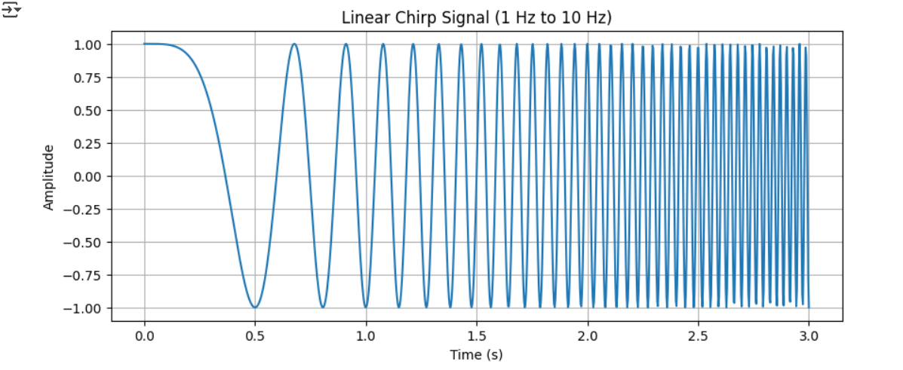

# STM32N6_TinyML_Playground
Getting hands on the new STM32N6 to test the onboard NPU capabilities. This project serves as a playground to test ML projects and test inferencing capabilities of the NPU.

The hardware I am using to evaluate this chip is the STM32N6DK Discovery Board

# Board Bringup
The `BOOT0` and `BOOT1` are setup in mode 1 and 2 respectively.

WIP to use xCubeAI tool to validate the ML models on our target device

# ML model
Currently exploring different ways to deploy the ML model. The model used for now will be a Time Series Prediction of a Chirp Signal.

